# Superstore Business Intelligence Platform

An interactive decision-support platform that converts retail transaction data
into clear management information across sales, profit, customers, products,
geography, pricing, operations, forecasting, predictive analytics, and
AI-assisted business analysis.

**Live application:** [superstore-business-intelligence.streamlit.app](https://superstore-business-intelligence.streamlit.app)

## Platform Home

The Home page provides immediate confirmation that the dataset loaded correctly,
summarizes the principal business KPIs, exposes the shared dashboard filters, and
provides a preview of the processed transaction data used throughout the platform.

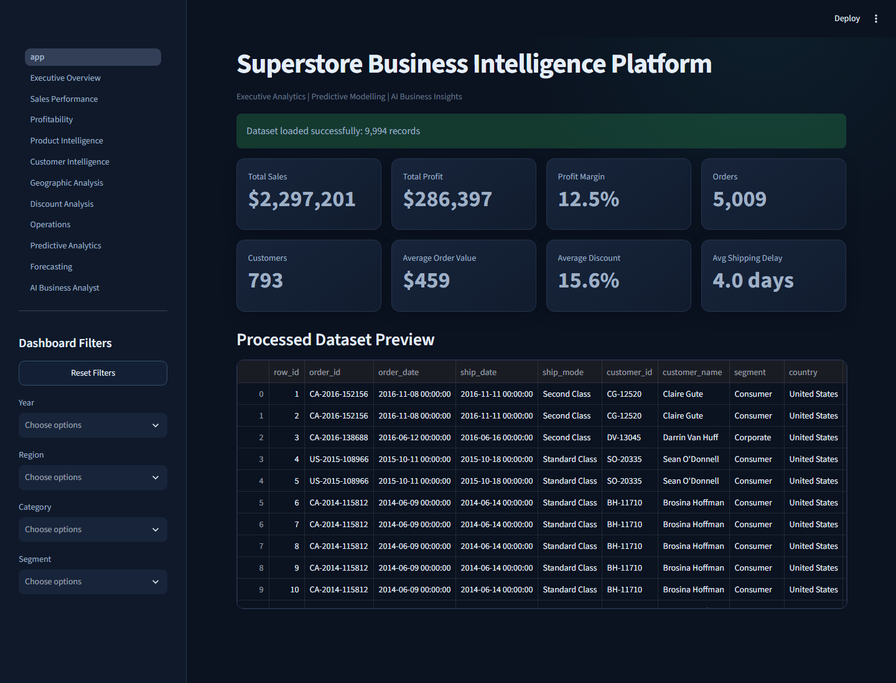

---

## Executive Summary

Retail businesses generate large volumes of order data, but transaction records
alone do not explain where growth originates, which activities destroy margin,
which customers deserve attention, or where management should intervene.

The Superstore Business Intelligence Platform brings those questions into one
connected analytical environment. It gives decision-makers a consistent view of
commercial performance and allows them to move from an executive result to the
region, customer, product, discount, or operational condition behind it.

The platform is designed to support four levels of business analysis:

1. **Descriptive analysis:** What happened?
2. **Diagnostic analysis:** Where did the result come from?
3. **Predictive analysis:** What may happen under similar conditions?
4. **Decision support:** What should management investigate or prioritize next?

It uses the Sample Superstore dataset as a realistic retail case study. The
application demonstrates how a management team can replace disconnected reports
and spreadsheet analysis with a shared, evidence-based decision workflow.

---

## The Business Problem

Revenue growth does not automatically create profitable growth. A business may
report strong sales while losing margin through excessive discounting,
unprofitable products, inefficient fulfillment, weak regional performance, or an
unfavorable customer mix.

Without an integrated analytical view, management faces several common problems:

- Sales and profitability are reviewed separately, hiding margin erosion.
- Aggregate results conceal loss-making products, customers, and locations.
- Discount decisions are made without visibility into their relationship with
  profit.
- Product and inventory priorities are influenced by revenue alone rather than
  demand, repeat ordering, and profitability together.
- Shipping performance is monitored operationally but not connected to financial
  outcomes.
- Forecasts and predictive models are difficult for business users to interpret.
- Management questions require repeated manual analysis from an analyst.
- Different teams may calculate the same KPI differently.

This platform addresses those problems by connecting commercial, customer,
product, geographic, pricing, and operational evidence in one application.

---

## Business Objectives

The platform is intended to help management:

- Establish a single view of sales, profit, margin, orders, customers, discount,
  and shipping performance.
- Identify the products, sub-categories, customers, states, and discount bands
  responsible for losses.
- Separate high-revenue performance from genuinely profitable performance.
- Find growth opportunities that retain acceptable margins.
- Detect concentration risk across products and markets.
- Evaluate repeat purchasing and customer value through RFM segmentation.
- Examine whether operational delays coincide with weak financial performance.
- Estimate future sales and assess forecast reliability before planning.
- Explore transaction-level profitability and sales predictions.
- Ask natural-language business questions using evidence calculated from the
  active dashboard data.

---

## Intended Users

| Stakeholder | Primary decisions supported |
|---|---|
| Executives | Overall performance, risk concentration, growth priorities, and management focus |
| Sales leaders | Revenue trends, regional contribution, category performance, and target setting |
| Finance teams | Profitability, margin leakage, loss concentration, and discount exposure |
| Product managers | Portfolio performance, product rationalization, growth candidates, and margin risk |
| Customer teams | High-value customers, loss-making relationships, retention, and RFM segments |
| Regional managers | State and city performance, market opportunity, and geographic risk |
| Pricing managers | Discount governance, promotional efficiency, and pricing-risk investigation |
| Operations teams | Shipping delay, fulfillment patterns, operational risk, and service performance |
| Planning teams | Forecast scenarios, expected demand direction, and model uncertainty |
| Business analysts | Cross-functional investigation and evidence-based management reporting |

---

## Dataset Scope

The analysis is based on the Sample Superstore retail dataset. In the unfiltered
view, the application analyzes:

- **9,994 transaction records**
- **5,009 unique orders**
- **793 customers**
- **1,862 products**
- Order history covering **2014 through 2017**
- Product, customer, geographic, discount, shipping, sales, and profit dimensions

All pages share filters for year, region, category, and customer segment. This
means a manager can select a business scope once and examine the same population
through every analytical perspective.

---

## Decision Workflow

The dashboard suite is arranged to support a natural management investigation:

```text
Executive result
      ↓
Sales and profit diagnosis
      ↓
Product, customer, and geographic drivers
      ↓
Discount and operational causes
      ↓
Predictive and forecast outlook
      ↓
AI-assisted management interpretation
```

Each page can be used independently, but the strongest business value comes from
following a result across multiple pages. For example, a weak profit margin can
be traced from the executive view to a sub-category, then to individual products,
their discount exposure, affected states, and associated customer segments.

---

## Dashboard Suite

### 1. Executive Overview

The Executive Overview provides the management starting point. It summarizes
sales, profit, margin, orders, customers, average order value, average discount,
and shipping delay, then connects those KPIs to time, category, and regional
performance.

**Business questions supported**

- Is the business growing profitably?
- Which categories and regions contribute most to the result?
- Are changes in sales accompanied by changes in profit?
- Which performance issues require deeper investigation?

**Management application**

Use this page for performance reviews, executive meetings, and initial variance
analysis before moving into specialist dashboards.

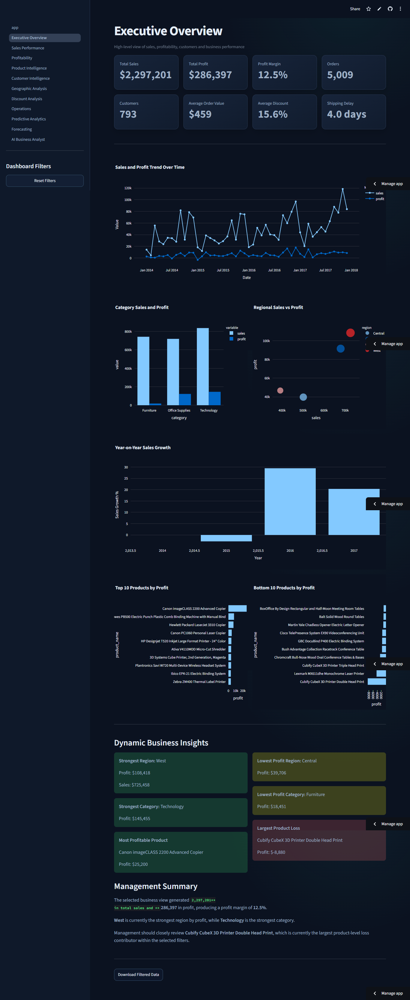

---

### 2. Sales Performance

The Sales Performance page examines revenue development across time and major
business dimensions. It helps distinguish sustained growth from isolated sales
spikes and shows how regions, categories, and customer segments contribute to
overall revenue.

**Business questions supported**

- Which periods generated the strongest sales?
- Where is revenue concentrated?
- Which categories, segments, and regions lead performance?
- Are recent results improving or weakening?

**Management application**

Use this page for sales reviews, territory planning, performance benchmarking,
and identifying the sources of revenue growth.

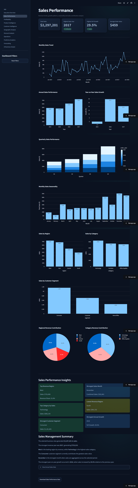

---

### 3. Profitability Analysis

The Profitability page evaluates whether revenue converts into earnings. It
separates high-performing areas from margin risk, growth opportunities, and weak
performance using sales-profit matrices and product-level loss analysis.

**Business questions supported**

- Which business areas generate profit rather than revenue alone?
- Where are high sales accompanied by weak profit?
- Which products create the largest losses?
- Which areas should be protected, improved, or reviewed?

**Management application**

Use this page for margin reviews, portfolio intervention, financial performance
management, and identifying profit leakage.

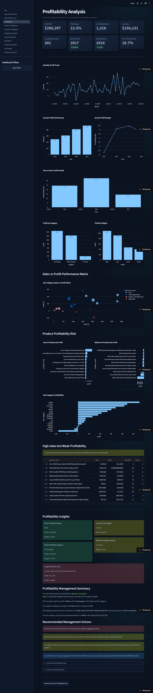

---

### 4. Product Intelligence

Product Intelligence moves from category and sub-category performance to
individual SKU behavior. It includes ranking, drill-down, portfolio segmentation,
Pareto analysis, discount exposure, loss-making products, and growth candidates.

**Business questions supported**

- Which products generate the most sales and profit?
- How concentrated is profit among a small number of products?
- Which products are margin risks or persistent loss makers?
- Which products combine demand, repeat ordering, and positive economics?

**Management application**

Use this page for assortment reviews, product rationalization, vendor discussions,
pricing investigation, and evidence-based replenishment shortlists.

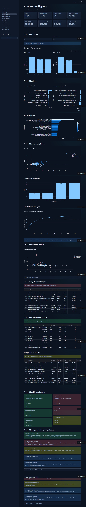

---

### 5. Customer Intelligence

Customer Intelligence evaluates customer contribution beyond total revenue. It
identifies high-value and loss-making customers, measures repeat purchasing, and
uses recency, frequency, and monetary value to create actionable RFM segments.

**Business questions supported**

- Which customers are most valuable and profitable?
- Which high-revenue customers create margin risk?
- How strong is repeat purchasing?
- Which customers are champions, loyal, potential loyalists, or at risk?

**Management application**

Use this page for account prioritization, retention campaigns, relationship
reviews, customer profitability analysis, and targeted engagement strategies.

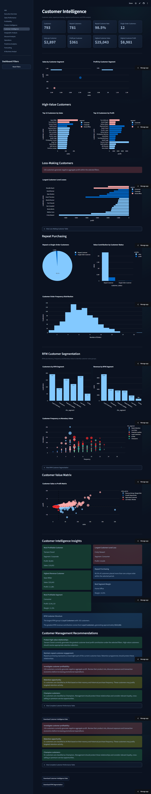

---

### 6. Geographic Analysis

The Geographic Analysis page compares regions, states, and cities through sales,
profit, margin, and market classification. It combines rankings, opportunity-risk
matrices, and map-based analysis to expose geographic concentration.

**Business questions supported**

- Which markets contribute the most sales and profit?
- Which states generate losses despite meaningful revenue?
- Where are the strongest expansion opportunities?
- Which cities or states require pricing, product-mix, or operating review?

**Management application**

Use this page for territory strategy, regional accountability, market investment,
and localized performance intervention.

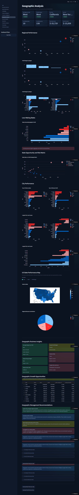

---

### 7. Discount and Pricing Analysis

The Discount Analysis page examines how promotional intensity is associated with
sales and profitability. It compares discount bands, identifies high-discount
exposure, and highlights products and sub-categories where pricing behavior may
be eroding margin.

**Business questions supported**

- Which discount bands remain profitable?
- At what discount levels do losses become concentrated?
- Which products and sub-categories have the greatest pricing risk?
- Are discounts supporting profitable volume or simply reducing margin?

**Management application**

Use this page for discount governance, promotional reviews, approval workflows,
and prioritizing areas for pricing and cost investigation.

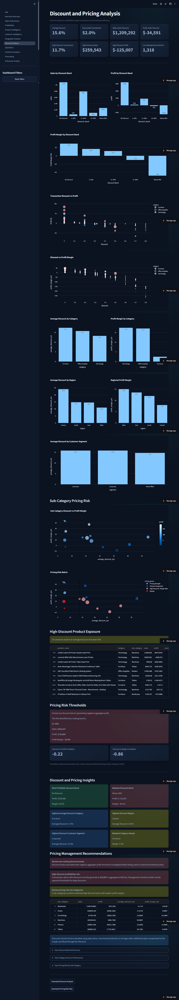

---

### 8. Operations and Shipping Analysis

The Operations page connects shipping behavior with commercial outcomes. It
reviews ship modes, delivery delay distributions, regional and category
fulfillment, state-level risk, and the relationship between delay and financial
performance.

**Business questions supported**

- Which ship modes and markets experience longer delays?
- Where do operational delays coincide with weak profitability?
- Which categories or states require fulfillment investigation?
- Are service patterns consistent across the business?

**Management application**

Use this page for service-level reviews, logistics investigation, regional
operations management, and prioritizing fulfillment improvements.

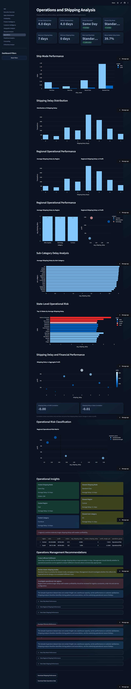

---

### 9. Predictive Analytics

Predictive Analytics provides two decision-support models: transaction
profitability classification and sales-value regression. It presents model
status, training results, evaluation metrics, an interactive prediction
simulator, and discount what-if analysis.

**Business questions supported**

- Which transaction characteristics are associated with profitability?
- What sales value might be expected for a proposed transaction profile?
- How sensitive is a prediction to discount changes?
- Is model performance strong enough for exploratory business use?

**Management application**

Use this page for scenario exploration and analytical education. Predictions
should inform investigation rather than automate pricing or customer decisions.

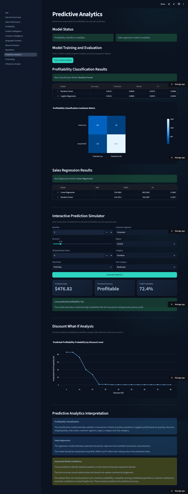

---

### 10. Sales Forecasting

The Forecasting page converts monthly sales history into a time-series planning
view. It supports holdout backtesting, forecast-quality metrics, future horizon
selection, confidence intervals, forecast data export, and management
interpretation.

**Business questions supported**

- What sales direction does historical behavior suggest?
- How accurately does the model reproduce unseen historical months?
- What range of outcomes should planning consider?
- How does forecast uncertainty change over the selected horizon?

**Management application**

Use this page as an input to budgeting, capacity planning, sales targets, and
inventory discussions, alongside operational knowledge and external forecasts.

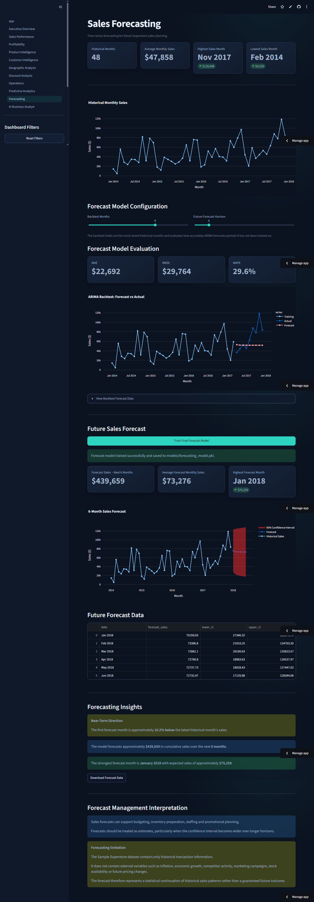

---

### 11. AI Business Analyst

The AI Business Analyst provides a conversational interface over the currently
filtered dataset. Suggested and user-defined questions follow the same governed
analysis process. Exact descriptive questions use deterministic Python evidence;
broader questions use the configured Gemini model to interpret Python-calculated
business summaries.

Responses are organized into:

- Direct answer
- Python-verified evidence
- Business interpretation
- Data limitations
- Recommended actions

The assistant rejects unrelated prompts, does not calculate financial figures
inside the language model, and explicitly identifies when the dataset cannot
support a definitive recommendation.

**Management application**

Use this page for rapid investigation, meeting preparation, management summaries,
and translating analytical evidence into clearly structured business actions.

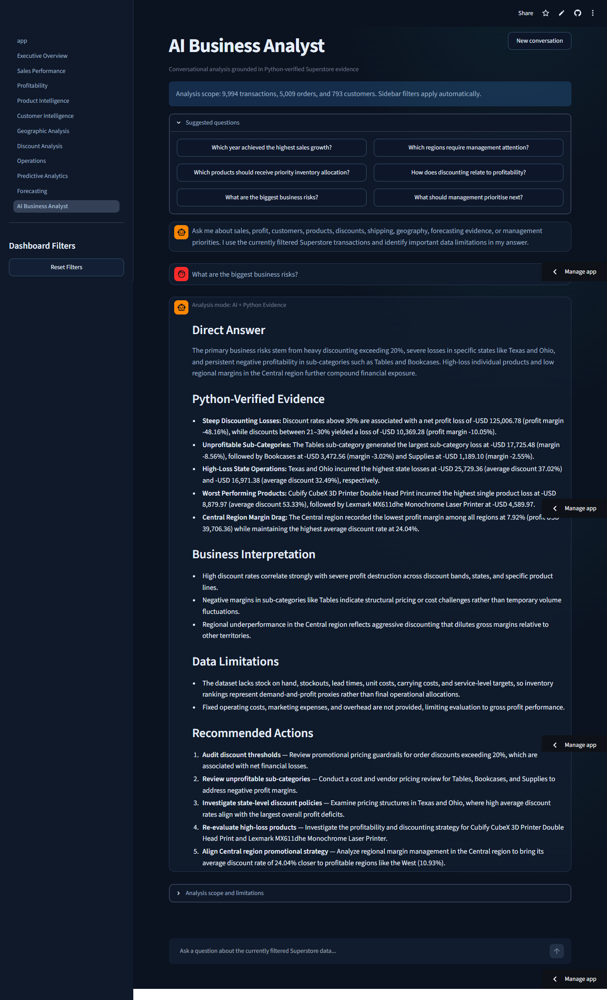

---

## Cross-Dashboard Business Applications

### Profit improvement

Management can identify a weak margin in the executive view, locate the affected
sub-categories in Profitability, inspect individual products in Product
Intelligence, and determine whether discount exposure or geographic concentration
is associated with the losses.

### Customer and account strategy

Customer Intelligence separates revenue size from customer profitability and
engagement. Account teams can prioritize valuable relationships, investigate
loss-making customers, and tailor retention activity by RFM segment.

### Pricing governance

Discount Analysis shows where loss concentration increases across discount bands.
The evidence can support targeted pricing audits and approval reviews without
assuming that historical correlation proves causation.

### Market prioritization

Geographic Analysis distinguishes high-sales markets from profitable markets.
Regional managers can compare opportunity, margin risk, product mix, and discount
patterns before committing investment.

### Product and inventory review

Product rankings combine historical demand and profitability evidence. They can
produce a management shortlist, but a final inventory allocation requires stock,
lead-time, carrying-cost, and service-level data that the source does not contain.

### Planning and scenario analysis

Forecasting provides a time-series outlook, while Predictive Analytics explores
transaction scenarios. Together they help teams discuss possible outcomes and
uncertainty rather than relying on a single-point estimate.

---

## Analytical Governance

The application follows several principles intended to make its output suitable
for responsible business use:

- **One filtered population:** All analyses use the current dashboard filters.
- **Python-verified metrics:** Business figures are calculated before they reach
  the AI interpretation layer.
- **Evidence separated from interpretation:** Observations, implications,
  limitations, and recommended actions are presented separately.
- **Correlation is not causation:** Discount, shipping, and profit relationships
  are treated as associations unless stronger evidence exists.
- **Scope control:** The AI analyst rejects prompts unrelated to the dataset.
- **Transparent limitations:** Recommendations state when important operational or
  external information is unavailable.
- **Human accountability:** Forecasts, predictions, and AI responses support
  management judgment; they do not replace it.

---

## Important Business Limitations

This is a transaction-level analytical case study, not a complete enterprise
planning system. The dataset does not include:

- Current inventory and stockout history
- Supplier lead times and purchase commitments
- Product acquisition and carrying costs
- Detailed fulfillment and freight-cost components
- Marketing expenditure and campaign attribution
- Competitor activity and market size
- Customer satisfaction and service-quality measures
- Product return and cancellation behavior
- Economic, seasonal, and industry drivers outside the dataset

As a result:

- Product discontinuation recommendations should be treated as review candidates.
- Inventory rankings are demand-and-profit proxies, not purchase orders.
- Discount analysis does not independently prove that discounts caused losses.
- Forecasts represent historical patterns, not guaranteed future results.
- Predictive outputs should not be used as automated decision rules.

---

## Success Measures

In a real business deployment, the platform's value could be evaluated through:

- Reduction in recurring manual reporting effort
- Faster identification of loss-making products and markets
- Improved consistency of KPI definitions across teams
- Lower profit leakage from poorly governed discounting
- Increased share of profitable rather than revenue-only growth
- Better prioritization of customer and product reviews
- Improved forecast monitoring and planning discipline
- Shorter turnaround time for management questions

---

## Using the Application

1. Open the live application or run it in a local Streamlit environment.
2. Select year, region, category, or segment filters from the sidebar.
3. Begin with Executive Overview to understand the selected scope.
4. Move to the relevant specialist page to diagnose the result.
5. Use Predictive Analytics or Forecasting when the decision involves outlook or
   scenario exploration.
6. Use the AI Business Analyst to summarize evidence or ask a cross-functional
   question.
7. Validate recommendations against information outside the dataset before acting.

---

## Conclusion

The Superstore Business Intelligence Platform demonstrates how historical retail
transactions can be converted into an integrated management decision system. Its
value is not limited to displaying charts: it connects performance measurement,
diagnosis, planning, and governed AI interpretation in a single workflow.

The result is a practical portfolio project and a reusable blueprint for business
intelligence applications that need to explain not only what happened, but where
management should investigate next and what additional evidence is required
before making a decision.
